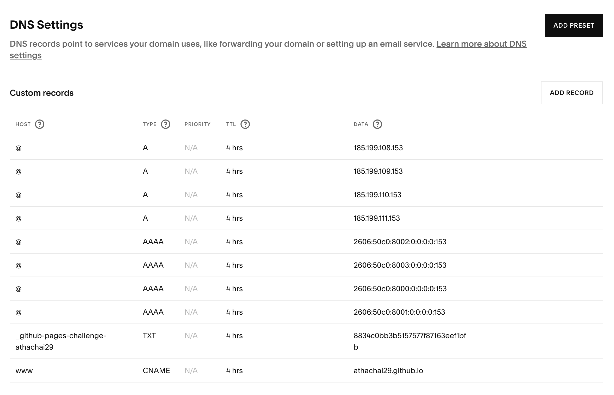
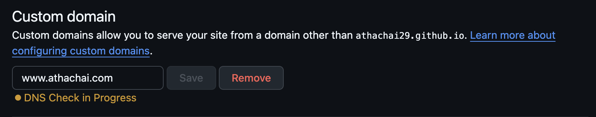

# The struggles I found when I set up this site

I try to make this website as plain as possible.  
So I don't use any framework.
Just HTML, CSS, JS, GitHub Pages, and Squarespaces.  
The first three are the backbone of web technology.  
The next is the server.  
And the last one is a domain name service.  
(Thanks for the present technology that makes everything easier.)

The first struggle I found is, "Why doesn't my new domain point to my website?"  
Because I've set it up wrong in the Squarespaces.

The correct way should be like this.

The second struggle is, "Why the f*** is it still not pointing to my website?"  
And the next learning thing is coming.  
"You have to wait."  
You have to wait for the DNS server to set things up.

When you saw this message, you had to wait.

Let the process continue and trust it.

Sometimes the lack of knowledge can waste your time more than it should be.  
No matter how much experience you have.  
You'll always forget some basics and miss some stupid things. 
